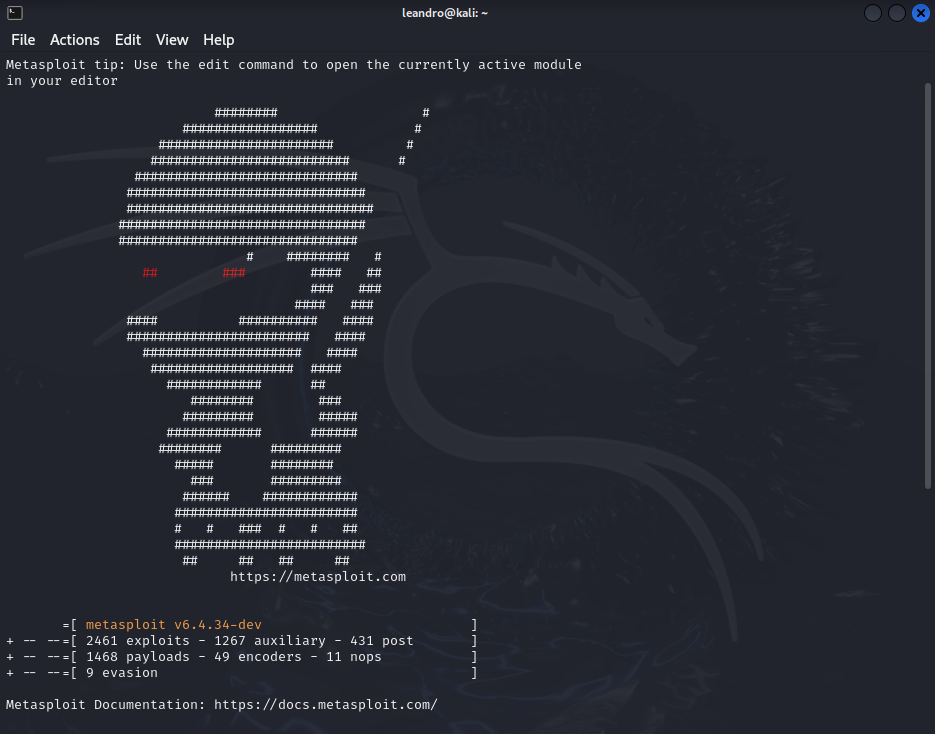
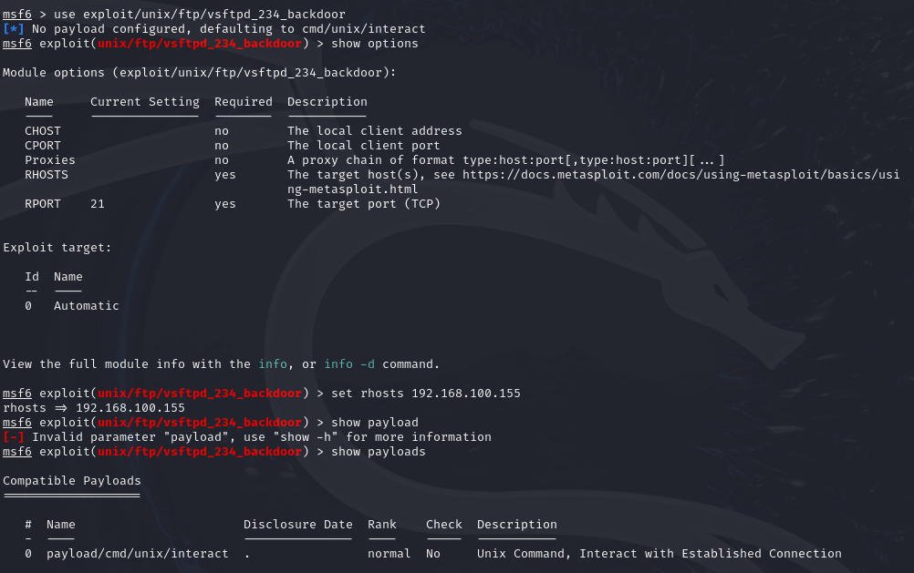
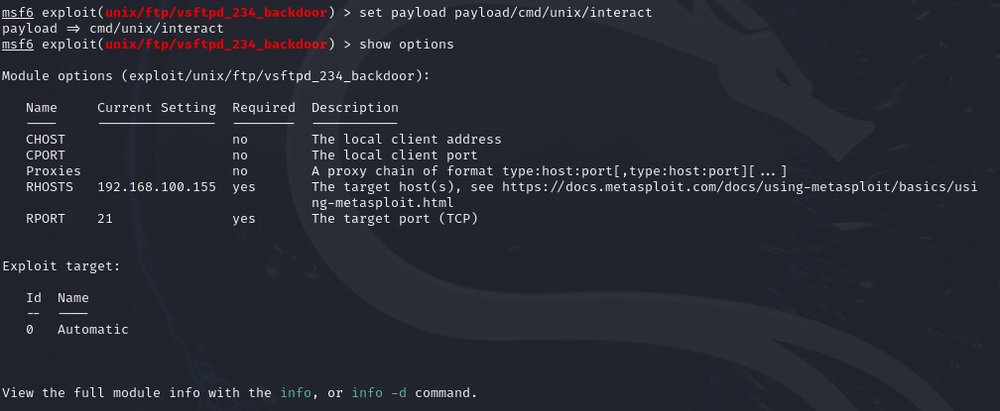
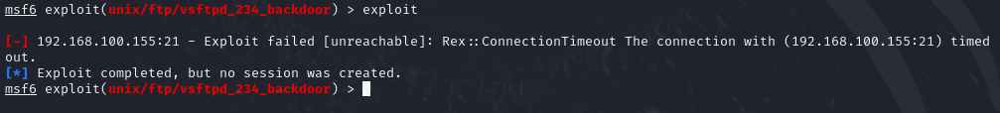

# FTP

    -Anonymous authentication
    -Directory traversal attack
    -Cross-site scripting
    -Dridex

## Tools

-Kali Linux
-Metasploit
    - ``` msfconsole ```
    - ``` msfweb ``` 
    - ``` msfplayload ```
    - ``` msfcli ```
    - ``` msflogdump ```

## Payloads

    - Singles
    - Stagers
    - Stages

### Starting exploit

- Open Metasploit



- Now you need use the IP from the target machine you want to exploit






- When all are done, type exploit

### Results

- Once there isnt Open FTP's Port, the exploit failed!

